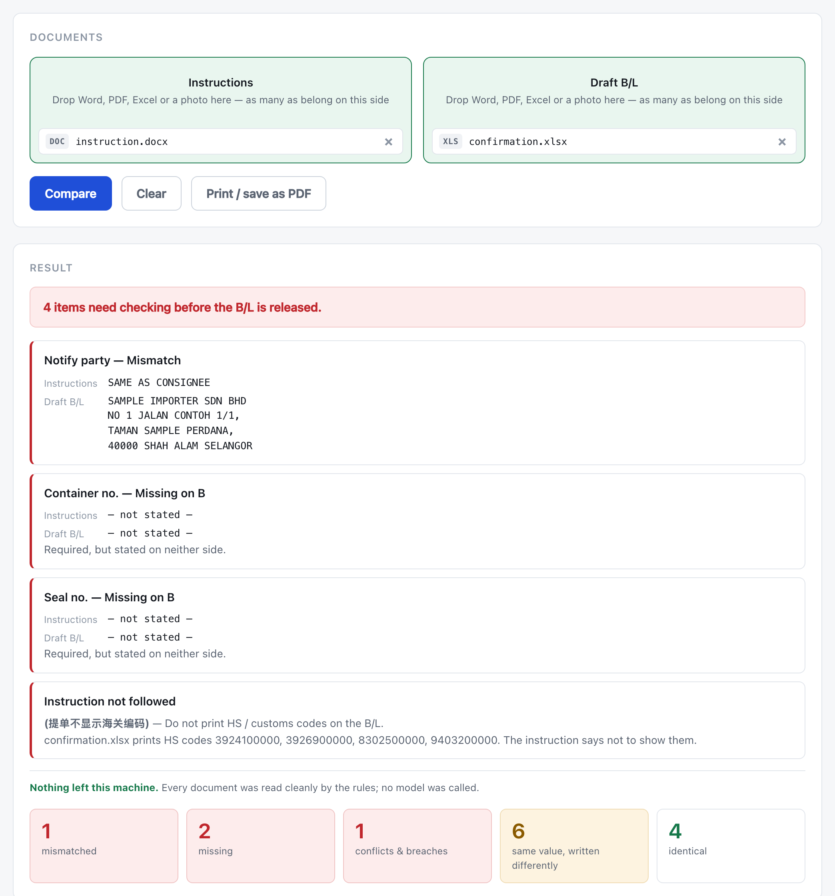
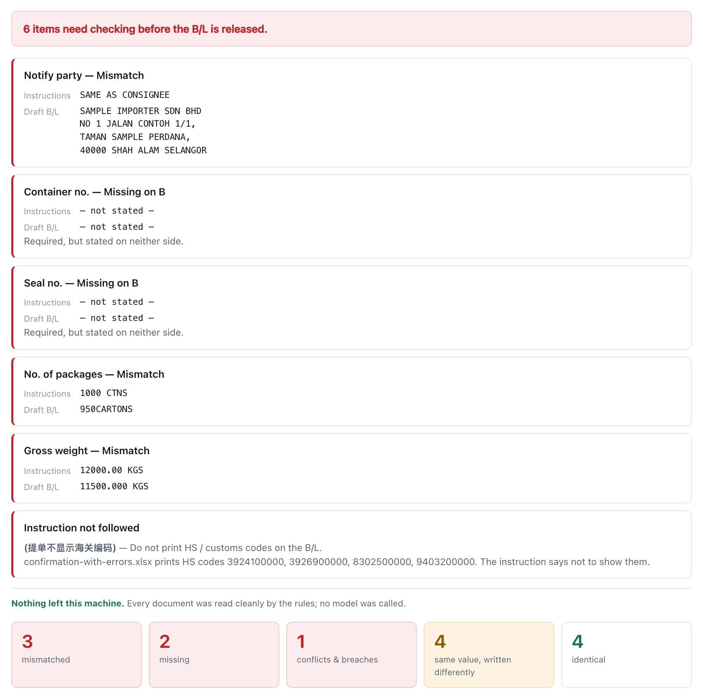
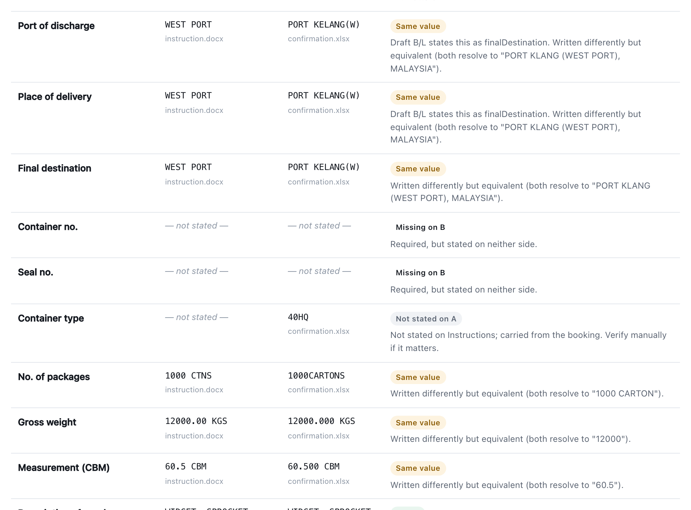

# SI / B-L Checker

Compares shipping paperwork against a draft bill of lading and reports every
value that disagrees — across **Word, PDF, Excel, and photographs**, on one
machine, offline.

Put the instructions on one side and the draft B/L on the other. Every field is
compared *after* normalising the things that differ harmlessly — trailing zeros,
`CTNS` vs `CARTONS`, `NORTH PORT` vs `PORT KELANG(N)` — so what's left is a real
discrepancy, not noise.



> The screenshots use a made-up shipment (SAMPLE IMPORTER / DEMO EXPORTER).
> No real customer documents are included in this repository.

## What it catches

- **Genuine mismatches** — a weight, carton count, port, or address that really
  differs. Formatting differences (`1000 CTNS` vs `1000CARTONS`,
  `12000.00` vs `12000.000`) are recognised as the *same value*, not flagged.
- **Instructions not followed** — Chinese notes like `(提单不显示海关编码)`
  ("don't print HS codes on the B/L") are read as rules and checked against the
  draft.
- **A document that contradicts itself** — a B/L whose cargo boxes and container
  line disagree.
- **Missing values** — something the instruction requires that the draft omits.
- **Extra fields** — non-standard entries (carrier, sailing date, cut-off date)
  surfaced separately, matched by label.



Formatting differences are recognised as the **same value**, not flagged as problems:



Every result also says plainly whether anything left the machine.

## Formats

Each side accepts any number of files, in any mix:

| Format | Read with | Notes |
|---|---|---|
| **Word** `.docx` | mammoth | shipping instructions |
| **PDF** `.pdf` | pdf.js | draft bills of lading (form-box layout) |
| **Excel** `.xlsx` | exceljs | forwarder confirmation sheets (提单确认件) |
| **Photo** `.jpg` `.png` … | PaddleOCR (on-device) | scans / phone photos of certificates |

Images are read by OCR that runs locally — no upload, no API key. The page is
straightened first, and every value read from an image is tagged *read from
image* and shape-checked before it's trusted.

## Run it (development)

Needs [Node.js](https://nodejs.org) 18.18+.

```bash
npm install
npm run dev
```

Open <http://localhost:3737>, drop your documents on the two sides, click
**Compare**.

## Desktop app (for a non-technical user)

It packages into a double-click app (no terminal, no browser) via Electron.
The Mac build is verified; the Windows installer is built on a Windows machine
or in the cloud. See **[PACKAGING.md](PACKAGING.md)** for the full steps —
including a one-click GitHub Actions workflow that produces the Windows `.exe`
without needing a Windows PC.

## How it works, briefly

Reading and comparison are separate. **Reading** turns each file into the same
set of fields (consignee, ports, vessel, container, packages, weight, goods …).
**Comparison** is plain, deterministic code — normalisers, a port-alias table,
OCR-slip folding — with a full test suite behind it.

A language model is **optional and offline-first**: it's consulted *only* when
the rules can't read a document (an unfamiliar layout, a poor photo), never to
decide whether two documents agree. For normal files nothing is sent anywhere.

The full design — box calibration, the double-spacing detector, port hierarchy,
OCR deskew, the fallback trigger — is written up in
**[docs/HOW-IT-WORKS.md](docs/HOW-IT-WORKS.md)**.

## Privacy

- Word, PDF and Excel are read entirely on this machine.
- Image OCR runs on-device; the models (~6 MB) download once, then it's offline.
- The optional model fallback only sends a document the rules couldn't read, and
  only if you configure a key. Each run tells you whether it happened.

## Tests

```bash
npm test
```

A clone runs `tests/samples.test.ts`, which exercises the pipeline end-to-end on
the synthetic sample documents — no real data involved.

The **full suite** (90 tests) runs against real customer documents that are kept
private (both the fixtures and the tests that assert on them are git-ignored), so
only the synthetic test is published here.

## Sample documents

`samples/` holds made-up documents you can try immediately:

```bash
npm run check -- samples/instruction.docx -- samples/confirmation.xlsx
npm run check -- samples/instruction.docx -- samples/confirmation-with-errors.xlsx
```
